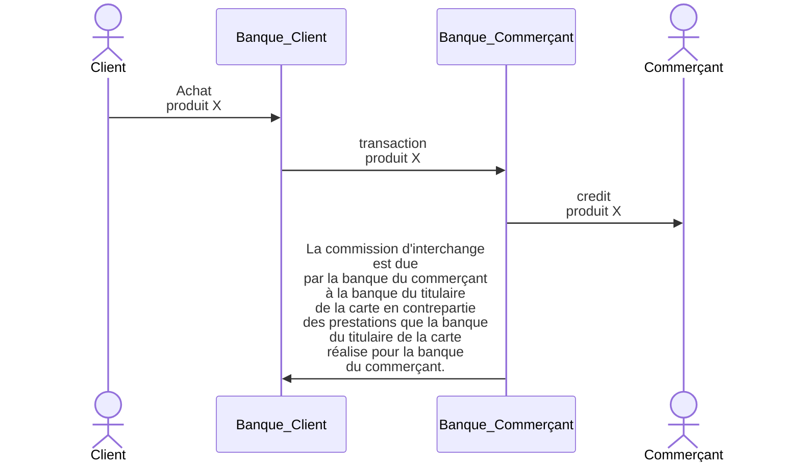

# Monétique

## Commission d'interchange (CB) 

- [Commission d'interchange](https://fr.wikipedia.org/wiki/Commission_d%27interchange)

> Dans le système des cartes bancaires à quatre parties (commerçant acceptant la carte ; banque du commerçant ; consommateur ; banque du consommateur), les coûts liés au fonctionnement du système ne se répartissent pas équitablement de manière spontanée. Ainsi la banque du consommateur doit supporter des coûts beaucoup plus lourds (assurances et remboursements divers en cas de fraude ou d’impayé, émission de la carte, paiement immédiat du commerçant même avec une carte à débit différé ou de crédit, avance de fonds gratuite en cas de débit différé, garantie de paiement pour le commerçant, etc.) que ceux supportés par la banque du commerçant (essentiellement constitués de la fourniture et de l’entretien du terminal de paiement)3.

- Commission d'interchange
  - Débit : 0,20%
  - Prépayé : 0,20%
  - Crédit : 0,30%
  - Commercial : 0,90%

- Les commissions d’interchange ont vocation à couvrir les coûts liés à 
  - l’acceptation, 
  - au traitement et à 
  - l’autorisation des transactions par carte. 
- Elles sont une garantie de paiement pour le commerçant, couvrent les coûts de protection contre la fraude et offrent une expérience d’achat commode à vos clients.

