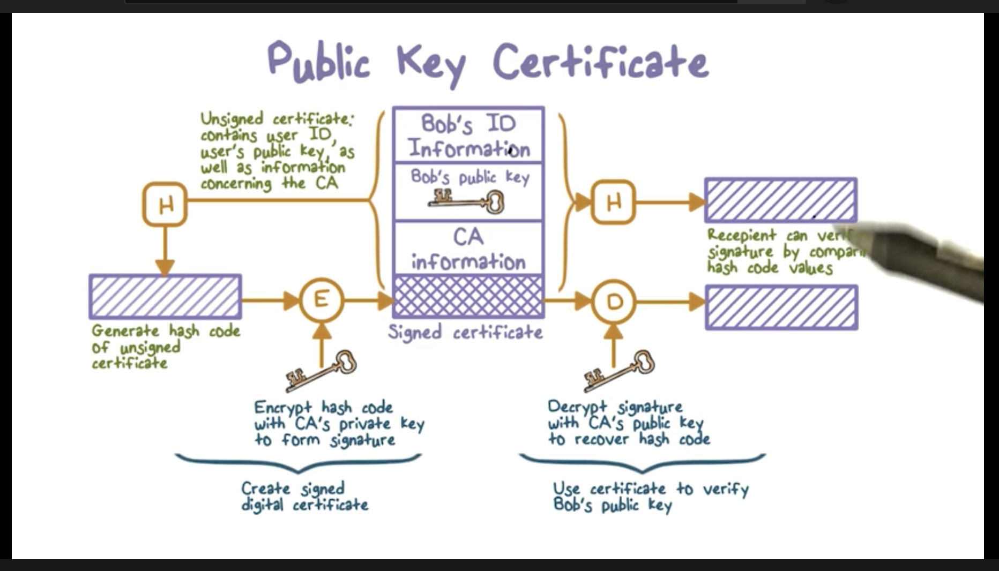
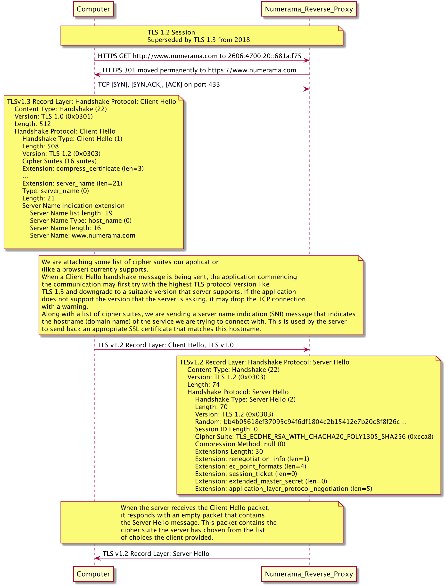
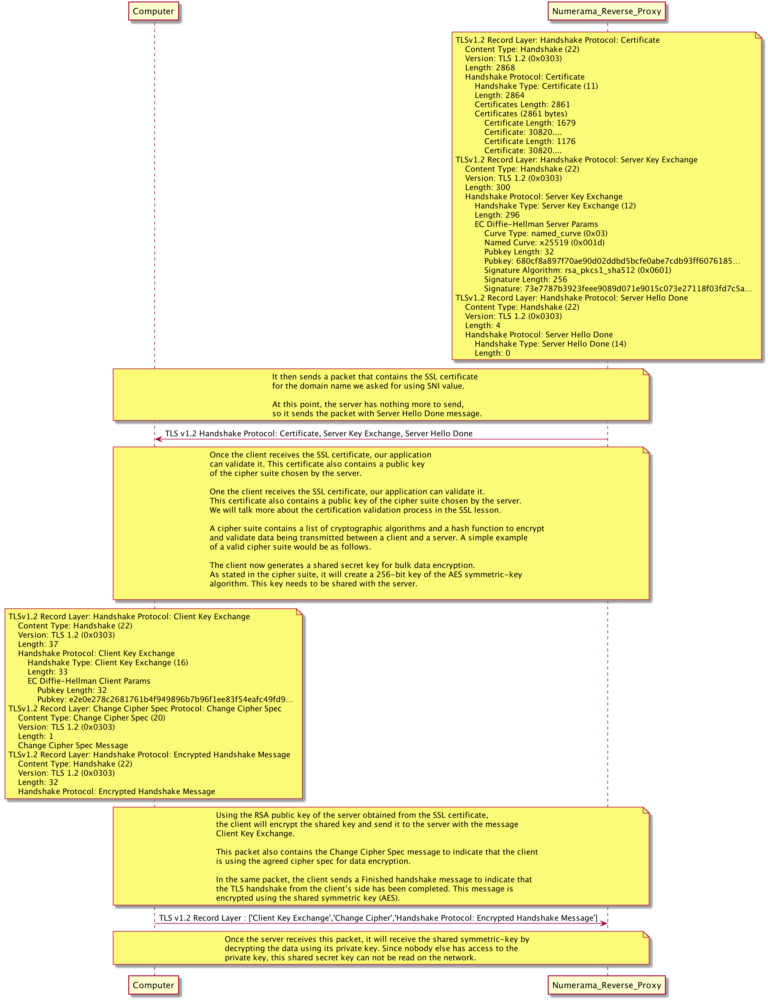
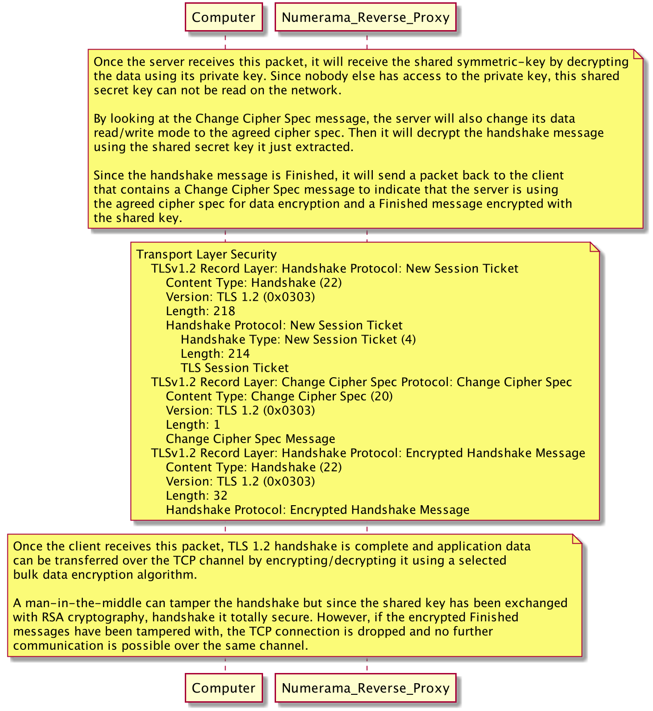
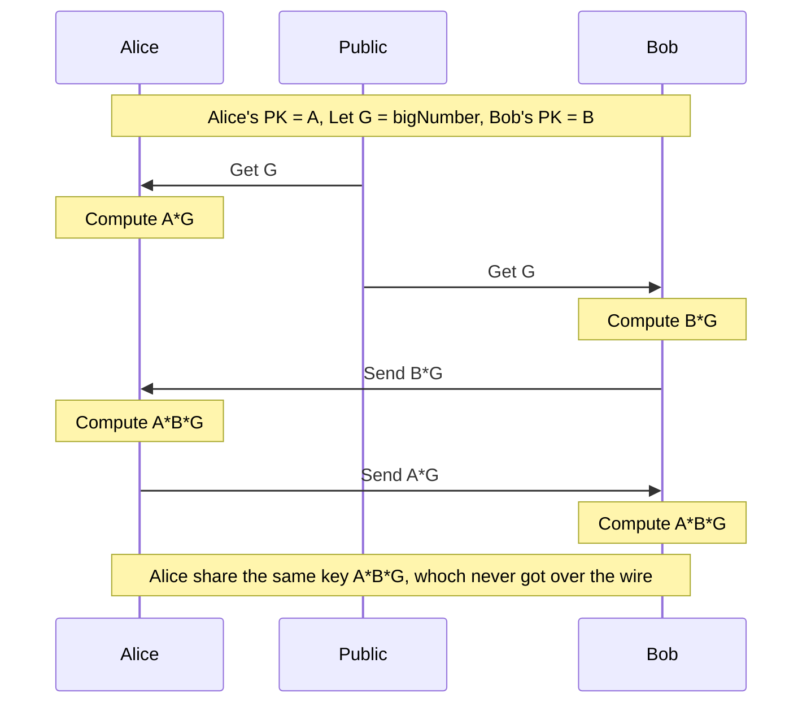

# Https

## How does it work ?


### Prerequisites

- You need to assume:
  - Any message encrypted with Bob's public key can only be decrypted with Bob's private key
  - Anyone with access to Alice's public key can verify that a message (signature) could only have been created by someone with access to Alice's private key

### Certificate Authority

Certificate of youtube is signed by Google CA. Both youtube and Google have a keyPair.

To use HTTPS, Youtube makes "Certificate Signing Request" made from its keyPair to Google CA.

In return, Google CA signs the certificate with its private key, anyone who has the public key from Google CA can verify the CA is who he claims to be.

Most browsers have a list of certificate that are delivered by known CA.


### Self signed certificate

To communicate securely with an app on staging env, you need to create an app with a private key and a public key. Next step would be to create a signing request, but no ones will sign this certificate.

In this case, a second pair of keys is created, by a CA you just created.

When a client connects to this app, the public key of the app gets retrieved and the client can detect it is not signed by a trusted authority.

The constaint is that you have to tell your client that the newly created CA can be trusted.

### Public Key Certificate



- Resolves the problem of public key forgery.
  - Certificate is basically a set of properties in clear text, associated with a period of validity and a public key. 
  - This piece of information is sent to CA where it is suffixed by CA information. The whole is hashed and encrypted (or signed) by CA private key. The certificate is now signed and can be sent everywhere. 
  - When someone downloads the certicate, he has access to CA public key and hence can decrypt the signing part, which gives the hashed data. But the receiver can also take the clear part of the certificate and hash it on his side. If both hash match, the certificate has been properly signed. The public key is validated.


## TLS

https://medium.com/jspoint/a-brief-overview-of-the-tcp-ip-model-ssl-tls-https-protocols-and-ssl-certificates-d5a6269fe29e

### TLS v1.3

https://www.davidwong.fr/tls13/

https://tls13.ulfheim.net/

https://tools.ietf.org/html/rfc3552

### TLS v1.2






### Diffie Hellman high level overview


Avoids the need to exchange keys by combining public variables and private secrets.
Alice and Bob agrees first on public variables they are going to use.
g : generator = small number
n : big prime number




## Utilities

### Check certificate validity

```bash exec="1" source="material-block"
echo \
    	| openssl s_client -connect google.fr:443 \
    	| openssl x509 -startdate -enddate -noout
```
