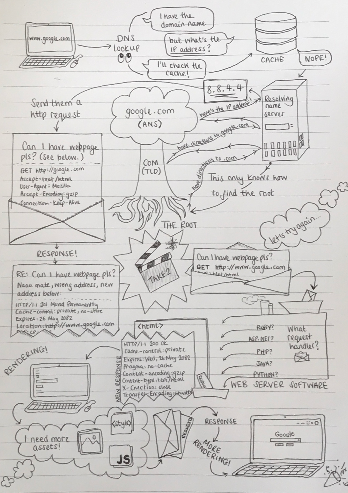
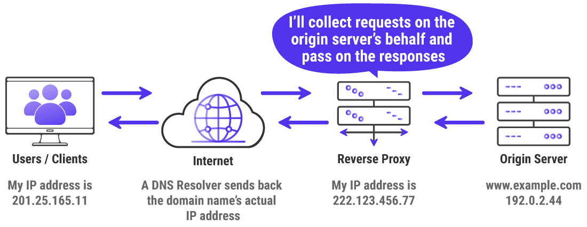
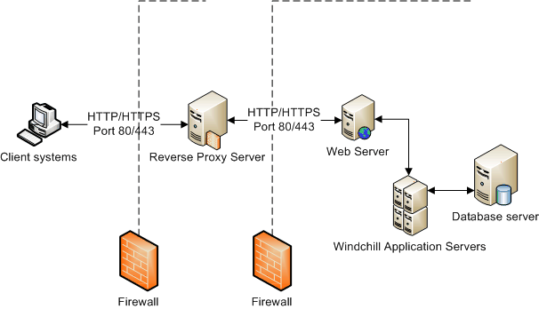

### What happens when you click on a link ?

- [https://www.freecodecamp.org/news/what-happens-when-you-hit-url-in-your-browser/](https://www.freecodecamp.org/news/what-happens-when-you-hit-url-in-your-browser/)

- [https://tara-ojo.medium.com/what-happens-when-you-click-a-link-in-the-browser-83b4337c78dc](https://tara-ojo.medium.com/what-happens-when-you-click-a-link-in-the-browser-83b4337c78dc)

### Reverse proxy

E2E internet communication:

Forward proxy:

Reverse proxy:

Reverse proxy with firewall:

BD (Octo talks)

https://blog.octo.com/bd-le-proxy-et-le-reverse-proxy/

### Quic

As Numerama is hosted by Cloudflare, they use Quic as session protocol (instead of Https).

- [https://cloudflare-quic.com/](https://cloudflare-quic.com/)

- [https://blog.cloudflare.com/http3-the-past-present-and-future/](https://blog.cloudflare.com/http3-the-past-present-and-future/)
