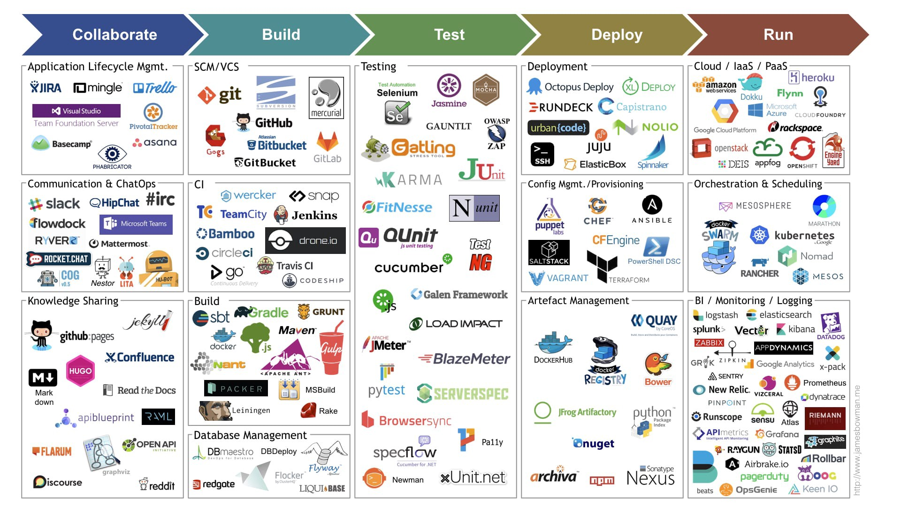
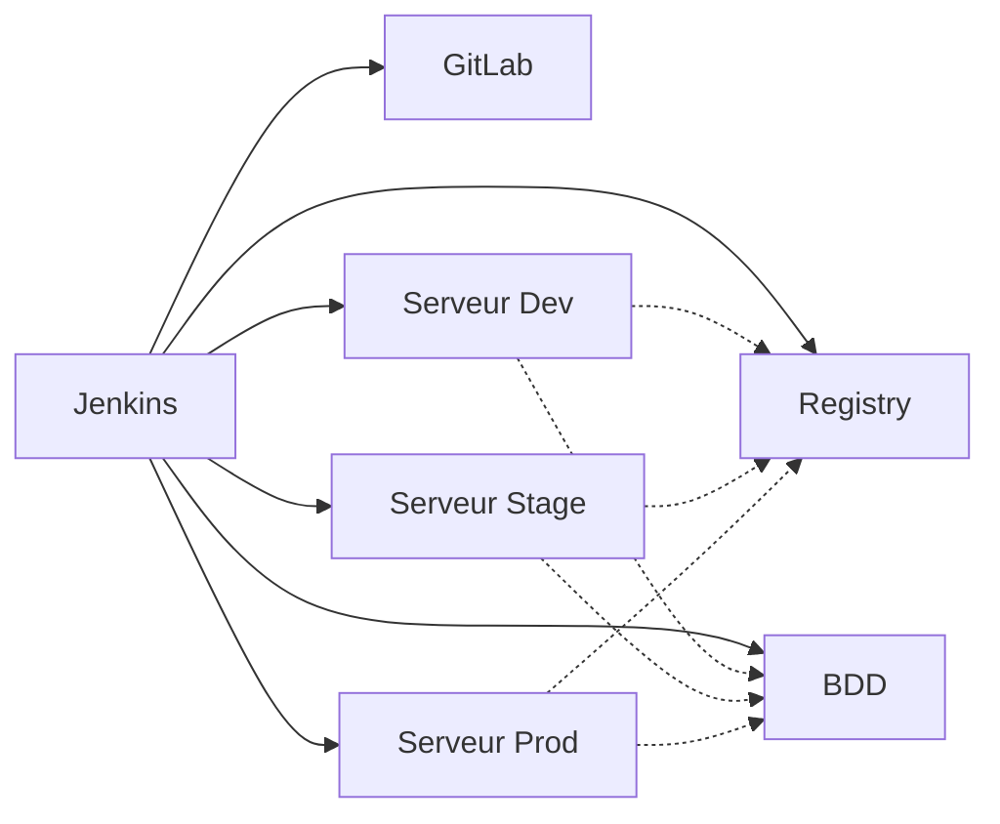

#### Qu'est-ce que le Devops ?
Origine industrialisation du secteur:

- Fordisme pour l'automobile
- Containerisation (multimodale) pour le transport maritime

cloud ou pas
docker ou pas

automatisation, standardisation = industrialisaiton

A la fois culture et poste.
- posture proactive pour automatiser
- connaissance des processus du code pour le faire évoluer, tester

#### Agile Scrum

Apport micro-service : feature team avec dev, po, devops pour faire des produits qui évoluent plus vite.

standup/sprints/backlog

Fail Fast: 
- l'échec doit intervenir le plus tôt possible
- aura un cout moins important
- process de traitement des échecs
- provoquer l'échec par des tests complexes (chaos monkey) pour avoir une résilience forte

#### La boite à outils

Le Devops doit couvrir un champ large avec un object de mettre en place la chaine de production.

- orchestrateur: (Ansible, chef, puppet). Gestion de l'idempotence (si on rejoue 2 fois le pipeline, l'orchestrateur doit voir que l'état final est déjà atteint et ne rien faire)
- ordonnenceur de tache: (Jenkins, GitlabCI). Lance des jobs triggé par des évolutions (ex: commit git)
- dépôt: (git, artifactory, registry) Permet le travail collaboratif
- testing: (Jmeter, PostMan, Junit)
- Notions bases de données
- Monitoring: (Prometheus, Graphana, Zabbix, ELK)
- Virtualisation: conteneur, cloud via ses pratiques
- Protocoles web

#### L'ingénieur Devops et ses techniques

Pipeline = ensemble de taches
- ex: data Pipeline : (collecte, aggregation, calcul, stockage)
- devops: deploiement d'un applicatif, du push au déploiement en prod
    - depôt
    - versionning
    - test
    - installation
- planifier/code/compile/test/livrer/deployer/superviser/-> planifier...



Etre capable de connaitre les outils et creuser en fonction de la techno.

Pipeline:
- Continuous integration: build test et merge pour construire le livrable applicatif
- Continuous delivery: fournir le code dans un état délivrable pour l'environnement cible
- Continuous deployment: git push provoque un redéploiement en production. Etat le plus poussé

Dans le tuto:
Scheduler : Jenkins
Orchestrateur: Ansible
Gitlab: Depot
Registry: Docker
Livrable: Image Docker
Gestionnaire de livrable: Maven

Pipeline offline

#### Git et GitFlow

Gitflow:
- utilisation des branches dans Git
- feature: evolution de code (seul branche non communautaire)
- dev: merge des features
- release: merge de dev pour faire des tests preprod
- master: merge de release pour envoyer en production

Indentifier les personnes qui ont le droit de merger sur les branches protégées

#### Infrastucture pour déployer localement

6 serveurs:
- Jenkins (jenkins, docker, docker-compose, ansible)
- Gitlab
- serveur BDD
- serveur devstage
- serveur stage
- serveur prod

- Docker en mode docker host

Vagrant virtual box



#### Installation de Jenkins

Installation sur la machine
- Utilitaires et ansible
- Java & Jenkins
- Customisation Ansible
    - activer pipelining
    - allow readable tmp true pour faire tourner des scripts distants (PG)
- Docker
    - ```usermod -aG docker jenkins``` pour que le user jenkins rentre dans le groupe docker
    - Registry de type insecure


Verification du lancement de Jenkins
```sh
sudo service jenkins status
```

doit être à active. Aller à l'adresse de la machine http://192.168.5.2:8080/. 
Initialiser le pwd

iop:iop

```sh
cat /var/lib/jenkins/secrets/initialAdminPassword
```

- "Install suggested plugin"
- créer un utilisateur "iop:iop"

#### Installation des serveurs applicatifs

Même bloc que le Vagrantfile de jenkins répété.

Si le Vagrantfile évolue, il faut rester dans le même répertoire.

```sh
vagrant up
```
Pour passer en root depuis un sudoer:
```sh
sudo -s
```

#### Installation de la BDD

vagrant up et test

#### Installation de la docker registry

le mdp de la registry est setté dans un fichier passwd/htpasswd
qui est généré par docker

iop:iop

Si
```
sudo docker login https://192.168.5.5:5000/v2/ -u iop -p iop
```
plante

Comme le certificat de la registry est auto-généré, coté client, il faut activer l'option dans le daemon /etc/docker/daemon.json

```json
{
    "insecure-registries": [
        "192.168.5.5:5000"
    ],
    "userns-remap": "dockremap:dockremap"
}
```

Redémarrer docker pour être sur qu'il est pris en compte:
```
sudo systemctl daemon-reload
sudo service docker restart
```

Lister les images sur la registry
```
curl -sk --user iop:iop https://192.168.5.5:5000/v2/myapp/tags/list
```


#### Installation de Gitlab

La registry docker de Gitlab n'est pas utilisée ici car elle a ses limites (tri par dates, clean des images).

credentials=root:gitlabce

permet d'ajouter un utilisateur non-admin

credentials=iopiop:gitlabce

ajout de la clé publique ssh
```sh 
pbcopy < ~/.ssh/id_ed25519.pub
```

Modification de l'external url dans /etc/gitlab/gitlab.rb

en http://gitlab-pipeline

sur Mac Os le /etc/hosts est dans /private/etc/hosts

#### Infrastructure de production

- Il manque une isolation réseau (VLAN) pour isoler les flux de chaque environnement.
- Idealement un Jenkins par env (dev/stage/prod)
- une BDD par env
- user mdp par env
- système de backup de Gitlab à mettre en place

#### Service : choix de l'applicatif

Java langage compilé.
- Spring Boot
- Hibernate
- JPA

API pour pouvoir utiliser des tests comme Jmeter
Gestion d'une dépendance à l'API: postgresql

#### Rappels sur Docker

```sh
docker --help
```
Informations sur le runtime (runc), les drivers réseaux, les drivers de log
```sh
docker info
```
le moteur docker peut-être configuré dans /etc/daemon.json
- remap user
- range ip
- driver de log
- proxy 

Accéder aux meta-data
```sh
docker inspect <container-id>
```

Lister les image
```sh
docker image ls
```
OU
```sh
docker images
```

Effacer un container
```sh
docker rm -f <container_name>
```

CMD est le process qui est lancé quand le container est instancié.

##### Network

On peut se passer de l'addresse IP des containers, en précisant ```--name <dd>``` dans la commande, les containers sont capables de se contacter par leurs noms sur un même bridge.

##### docker-compose

L'orchestrateur le plus simple possible, évite de faire des ```docker run``` à rallonge.
Versions. Yaml / docker-compose / docker engine


##### Job multibranch

Type = "Pipeline MultiBranche"
Le job multibranch permet degénérer autant de job que de branche... bref evite de les créeer à la main.


##### Trigger de Gitlab depuis Jenkins

###### Gitlab

Pré-requis: Permettre le traffic sortant de Gitlab vers le réseau local.
Se logger en tant qu'admin,
Aller dans la clé à molette, Settings, OutBound requests, Allow Requests to the local network from web hooks and services, ajouter l'IP de Jenkins)

###### Jenkins

Administrer Jenkins, Gestion des plugins, Available, Chercher "Gitlab Plugin".
Au lieu de configurer le job en click bouton, on peut le faire dans le job Jenkins.

Copier l'url dans la conf du job
 http://p1jenkins-pipeline:8080/project/MultiPipeline/iop
le token 

###### Gitlab

Settings, Webhooks
copier l'URL et le Secret token.
Activer le push events (l'event Merge Request n'est déclenché qu'avec la version Entreprise de Gitlab)

Décocher enable SSL verification.

Une seul webhook est nécessaire sur Gitlab pour le n branches

##### Build du jar sous docker

Les credentials pour pousser dans la registry sont saisis dans Jenkins
Manage Jenkins -> Manage credentials -> Global

iop:iop

Docker Pipeline plugin should be installed first.

Une fois l'image poussée sur la registry Docker, c'est la fin de l'étape de build.

#### Ansible

Permet 
- l'infra as code, user...
- Déploiement type pipeline

Quelques définitions:
- **inventory** permet de répertorier l'ensemble des serveurs
- **tasks** une ou plusieurs actions à réaliser
- **module** fonction appelé par une tache
- **role** regroupement cohérent de tache. ex: Role Nginx (apt-get install). Il faut mieux être plus fin, pour faire des choses universelles
- **playbook** fichier au format yaml qui fait la jonction entre les roles et l'inventory
- **group** permet de segmenter l'inventory suivant leurs roles
```yaml
all:
  vars:
    nom: "xavki"
  children:
    jenkins:
      hosts:
        192.168.5.2:
    registry:
      hosts:
        192.168.5.5:
```
jenkins et registry sont 2 groups.

Le répertoire
```sh
root
|-- group_vars/
```
contient les variables qui ont une portée suivant le fichier qui les héberge:
- all.yml -> appliqué partout
- registry.yml -> uniquement pour le group registry

Les variables sont injectées avec la convention {{ }} (python Jinja)

#### Ansible playbook et role

Playbook articule l'inventory, les roles avec les taches.

Un playbook basique execute une tache (ex: shell) sur un inventory.

Un playbook plus évolué appelle un role qui est un module dans lequel un certain nombre de taches sont décrites.

La commande Ansible-galaxy permet de définir la structure du role, avec comme point d'entrée des tasks

```sh
.
├── inventory.yml
├── monrole
│   ├── defaults
│   │   └── main.yml
│   ├── files
│   ├── handlers
│   │   └── main.yml
│   ├── meta
│   │   └── main.yml
│   ├── README.md
│   ├── tasks
│   │   └── main.yml
│   ├── templates
│   ├── tests
│   │   ├── inventory
│   │   └── test.yml
│   └── vars
│       └── main.yml
├── playbook.yml
```

defaults: variable par défaut
files: fichier non modifié
handlers: actions qui vont être triggée. Ex: reset d'un service
tests: comment tester

Ansible collecte des variables des Facts avant

Si on veut ajouter un fichier,

```yaml
- name: task2
  copy:
    src: fic.txt
    dest: /tmp/fic/txt
    owner: vagrant
    group:
    mode:
```

le fichier est à poser dans ```monrole/files/fic.txt```

le module template est similaire au module copy.

#### Ansible test connectivité

```sh
ansible all -i hosts.yml --user=vagrant -m "ping" -k
```

#### Ansible handlers

utilisation du module apt, qui nécessite une élévation de privilèges -> on ajoute become:yes à la racine du playbook.

use case des handlers:
dès que la cond du vhost de nginx est modifié, on doit faire un restart de nginx.

ajout d'un ```notify: <task cible>``` dans la task, la task cible étant dans ```handlers/main.yml```.

Variabilisation de la valeur d'un port dans ```group_vars``` pour sortir les spécificité d'un role et le rendre le plus générique possible.

#### Ansible requirements

Permet de télécharger des sources d'un dépot.


#### Ansible postgres

Role "lineinfile" est très puissant, il permet de modifier les fichiers de conf.
Les passwords sont à mettre dans Volt.

Faire la création du user et de la db avec le user postgres pour l'utiliser avec ansible.
Ensuite il fait le psql.

On peut surcharger le ansible.cfg en le mettant à la racine (à la place de /etc/ansible/)

#### Ansible organisation, roles dépots et requirements

 ansible-galaxy install --roles-path roles -r requirements.yml

 ansible-playbook -i env/dev/hosts -u vagrant -k install-myapp1.yml

#### Jenkins file. Ajout de ansible

Sur la machine Jenkins
```sh
sudo su - jenkins
```

Générer la clé RSA
```sh
ssh-keygen
```

Pousser la clé publique vers les autres machines
```sh
ssh-copy-id -i .ssh/id_rsa.pub vagrant@192.168.5.4
```

#### Performance report

Ajouter le plugin performance plugin