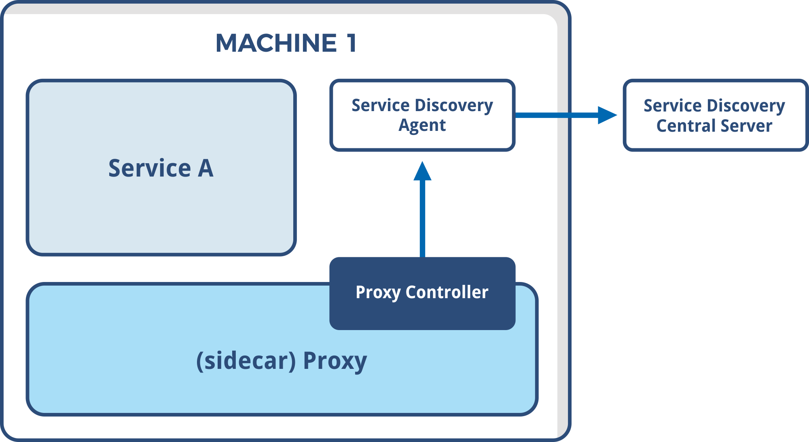

### Notions de base: Infrastructure Mutable vs Immutable

Mutable: Dépendant du système sous-jacent / Modifiable
Immutable : Indépendant du système sous-jacent / Non Modifiable

#### Mutabilité (script/apt-get/yum install) :
Pb :
- Gestion des dépendances obligatoire à chaque mise à jour d'un composant
- Rollback compliqué
- Scalabilité horizontale difficile
- Manque de compatibilité avec les infra "modernes" type cloud

Mais
- Livrable plus léger
- Répartition des roles plus facile entre dev et ops

#### Immutabilité (artefact, image docker) :
Cons:
- Plus lourd à packager (besoin d'infra as code)
 
Pros:
- Itérations plus facile à faire
- Versionning global : applicatif + dépendances
- Scalabilité horizontale plus facile (à partir d'une image par ex)

### Notions de base: Déclaratif vs Impératif

Dans les dernières technos (cloud), le style déclaratif est mis en avant (fichier de configuration). Sur des technos plus anciennes on retrouve souvent du style impératif.

Déclaratif : 
- descriptif
- Un fichier qui décrit l'état souhaité. (Ex: docker-compose / Kubernetes) le système gère l'état et le suis dans le temps, ce qui permet 
- l'auto réparation
- simplification de la gestion.

Impératif: (ex: apt-get install nginx). L'opérateur réalise les commandes qu'il souhaite. Nécessite de mettre en place le suivi à postériori de la commande (Monitoring).

### Notions de base: Microservice

Concept "de pointe" dans l'IT.

- Périmètre restreint (pizza team)
- Développement plus rapide, plus simple, plus agile
- Versions plus facile à itérer
- Plus facile à tester
- BDD plus simple et plus petite

Mais:
- Il faut gérer les fluxs
- Réseau plus sollicité
- Infrastructure plus complexe et plus dure à modéliser
- Nécessité de standardiser les échanges (APIfication)
- Communication importante

### Notions de base: 12 Factors app

Vient d'Heroku. Encourage à utiliser :
1. une base de code centralisée et versionnée (-> git)
2. des outils de gestion de dépendances (-> maven)
3. une configuration unique pour tous les envs, modulée ensuite par les variables d'environnement (ex: Docker)
4. Les services externes doivent être utilisés comme des éléments externes (connecteurs pour BDD)
5. Build (construire) Realease (versionner) Run (déployer) : ne pas mélanger dans les pipelines
6. Processus : idéalement sans état (stateless) pour permettre la scalabilité horizontale
7. Association de ports: les services communiquent sur un port
8. Gestion de la concurrence: scalabilité horizontale plutôt que verticale.
9. Jetable: un processus doit s'arrêter de manière gracieuse sans empêcher la relance de nouveaux services.
10. Parité Dev/Prod: intégrer les devs aux mises en prod.
11. Logs: Flux d'événements (logstash dans ELK)
12. Processus d'administration: a l'echelle du service, le code administratif et applicatif doivent être au même endroit

### Notions de base: Stateful vs Stateless

#### Stateless
Une application stateless:
- ne conserve pas les infos liées à une requête ou connexion
- peut être déployée sur plusieurs instances
- utilisation des cookies pour le persister le state
- la perte d'une noeud qui héberge une application stateless n'est pas critique
- permet le scaling horizontal

Load balancing sans besoin de sticky session

Mais:
- fait appel à plus d'éléments externe (BDD, API, Authent°)

#### Stateful
Une application:
- conserve l'état dans l'application (et pas dans la base)
- scalabilité horizontale impossible, verticale uniquement
- Nécessite d'utiliser le sticky-session sur le load balancer

### Notions de base: IAAS PAAS SAAS CAAS FAAS

- ..AS as a service, pas besoin d'action/d'installation préalable.
- poussé par le cloud
- automatisé/automatisable

#### IAAS

Infra as a service fournit:
- réseau / stockage / serveurs / virtualization

Permet de déployer:
- OS / Middleware / Runtime / Datas / Applications

#### PAAS

Program as a service. Fournit:
- réseau / stockage / serveurs / virtualization / OS / Run / Middleware

Permet de déployer
- Datas / Applications

#### SAAS

Software as a service. Fournit:
- réseau ... applications

Permet à l'utilisation d'amener uniquement ses données.

#### CAAS

Container as a service.

- réseau ... containers

L'utilisateur lance des containers docker, kubernetes.
Ex: GKE

#### FAAS

Function as a service.

- réseau ... fonctions

L'utilisateur lance des fonctions.

exemples

### Notions de base: Mesh alias service discovery

Mesh ~ Routing Mesh

Principe: le routing mesh doit suivre le maillage prédéfini.

- S'intègre dans une architecture micro-service, en facilite la configuration dans un contexte où les IPs sont éphémères.
- Facilite le scaling horizontal, permet d'instancier de nouvelles instances dédiées à un service auprès des reverse proxies.
- Implémente facilement le circuit breaker, évite l'effet boule de neige.
- Meilleure gestion des retryables (capacité de réessayer la requête)

Pet vs Cattle

La localisation des services doit être abstraite.
mise en place d'une registry de service (consul, zookeeper)

#### Architecture

MESH = système registry + reverse proxy sidecar + service.

Agent registry remonte l'état du service dans la registry. Ex Consul-Connect

Le reverse proxy:
- peut rediriger une requete qui ne lui ai pas destinée et jouer le rôle de Load Balancer.
- évite d'exposer directement le service applicatif.

Reverse Proxy:
- Envoy
- Linkerd
- HAProxy
- Nginx

Registry:
- Consul
- Zookeeper

Package complet:
- Istio (Envoy, Pilot)

#### Définitions :
- Data Plane : collecte d'info pour savoir qui se situe où.
- Control Plane : Outil de gestion de la registry externe, monitoring.

### Notions de base: Kubernetes vs Swarm

Orchestrateurs de container.
Pool de master (1 ou plus) et de worker (1 ou plus)

Implémentent des services discovery / réseaux / stockage

Installation de Kubernetes plus touchy (désactiver le SWAP, plusieurs packages à installer kubelet, kubeadm) par rapport à Swarm.

Les 2 installations ont des CLIs.

Monitoring moins rigide, plus automatisable (Prometheus/Graphana/ELK). Installation de daemon set sur chaque noeud.

Scalabilité manuelle pour Swarm, manuelle ou hpa pour Kubernetes.

Rolling update: pour Kubernetes stratégie personnalisable, historique rollback facile

Network: sur Swarm l'encryption est automatique. Kubernetes est plus ouvert mais il faut connaitre les solutions. Attention à rester piégé dans une solution.

Au final:

Swarm
- plus facile
- plus facile à maintenir
- moins de choix : scalabilité rolling update
- moins production ready (rollback, rolling update)
- dépendances à docker

Kubernetes
- plus de notions et plus complexe
- ajout d'une couche d'abstraction au dessus des conteneurs
- bcp de choix possibles dans de nombreux domaines
- production ready
- communauté importante
- pas de dépendances à docker

### Notions de base: HTTPS

Hypertext Transfer Protocol Secure

Protocole d'échange entre clients et serveurs:
- authentifaction (certifie que le client est le bon)
- intégrité (données)
- confidentialité (prévient les mmi-attacks)

Permet d'adresser les man in the middle attack sur HTTP non sécurisé. Plusieurs protocoles:
- SSL (ancêtre)
- TLS (Transport layer security)

Trade-off entre chiffement et Performance.

TLS 1.0 et 1.1 seront obsolètes en 2020.
TLS 1.2: 2008
TLS 1.3: 2018

Le type du certificat est x509.

