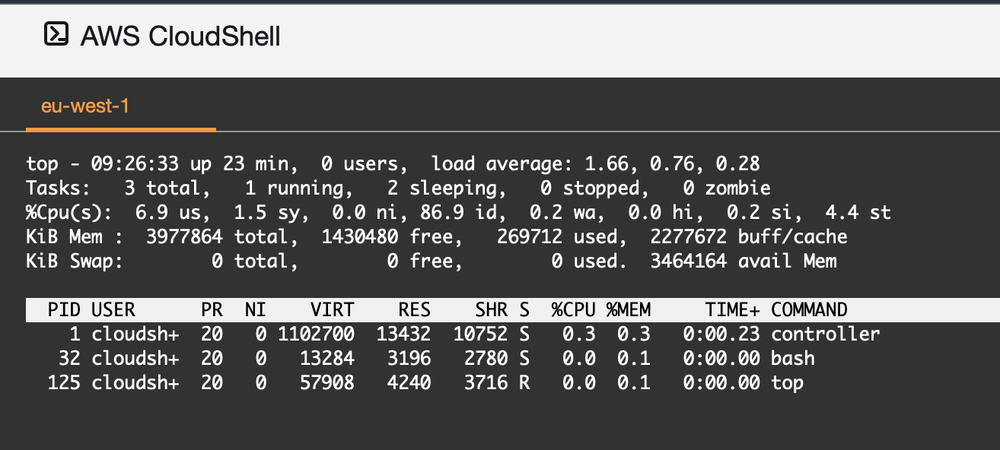
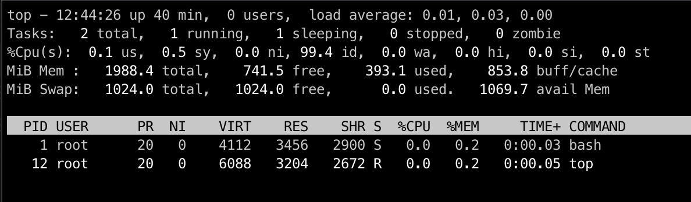
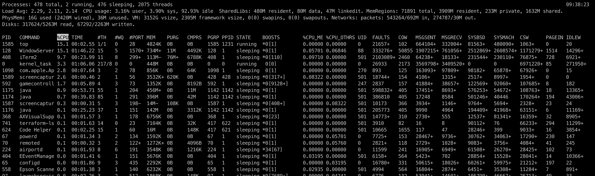

### Monitoring with map

- [https://github.com/flant/grafana-statusmap](https://github.com/flant/grafana-statusmap)

### Kernel monitoring

- [https://blog.zenika.com/2019/07/15/decouverte-ebpf/](https://blog.zenika.com/2019/07/15/decouverte-ebpf/)    

### Top
Notes from:

- [https://www.booleanworld.com/guide-linux-top-command/](https://www.booleanworld.com/guide-linux-top-command/)

#### Linux top

The most widely used version top version comes with the package **procps-ng**, to check which version of top your are using:
```
top -v
```

#### Centos top




#### Ubuntu top



- [top_linux.pdf](top.files/top_linux.pdf)

Interactive mode:

Switch to forest view : v / V

Showing full path : c / C


#### MacOS X top



| Column     | Description                                                                                                                                           |
|------------|-------------------------------------------------------------------------------------------------------------------------------------------------------|
| pid        | Process ID                                                                                                                                            |
| command    | Command name                                                                                                                                          |
| cpu        | CPU usage.  (default)                                                                                                                                 |
| cpu_me     | CPU time charged to me by other processes                                                                                                             |
| cpu_others | CPU time charged to other processes by me.                                                                                                            |
| csw        | The number of context switches                                                                                                                        |
| time       | Execution time                                                                                                                                        |
| threads    | alias: th, Number of threads (total/running)                                                                                                          |
| ports      | alias: prt Number of Mach ports                                                                                                                       |
| mregion    | alias: mreg, reg Number of memory regions.                                                                                                            |
| mem        | Physical memory footprint of the process.                                                                                                             |
| rprvt      | Resident private address space size.                                                                                                                  |
| purg       | Purgeable memory size.                                                                                                                                |
| vsize      | Total memory size.                                                                                                                                    |
| vprvt      | Private address space size.                                                                                                                           |
| kprvt      | Private kernel memory size.                                                                                                                           |
| pgrp       | Process group ID.                                                                                                                                     |
| ppid       | Parent process ID.                                                                                                                                    |
| state      | alias: pstate Process state One of "zombie", "running", "stuck" (i.e. uninterruptible sleep),  "sleeping", "idle", "stopped", "halted", or "unknown". |
| uid        | User ID.                                                                                                                                              |
| wq         | alias: #wq, workqueue The workqueue total/running.                                                                                                    |
| faults     | alias: fault The number of page faults.                                                                                                               |
| cow        | alias: cow_faults The copy-on-write faults.                                                                                                           |
| user       | alias: username Username.                                                                                                                             |
| msgsent    | Total number of Mach messages sent.                                                                                                                   |
| msgrecv    | Total number of Mach messages received.                                                                                                               |
| sysbsd     | Total BSD syscalls.                                                                                                                                   |
| sysmach    | Total Mach syscalls.                                                                                                                                  |
| pageins    | Total pageins.                                                                                                                                        |
| boosts     | The number of boosts held by the process.  This is followed by the number of times the process has transitioned                                       |

### Terraform


- [https://github.com/bridgecrewio/checkov](https://github.com/bridgecrewio/checkov)

- [https://github.com/terraform-docs/terraform-docs](https://github.com/terraform-docs/terraform-docs)

- [https://github.com/terraform-linters/tflint](https://github.com/terraform-linters/tflint)

- [https://github.com/liamg/tfsec](https://github.com/liamg/tfsec)

- [https://formulae.brew.sh/formula/coreutils](https://formulae.brew.sh/formula/coreutils)

- [https://github.com/bridgecrewio/checkov](https://github.com/bridgecrewio/checkov)
