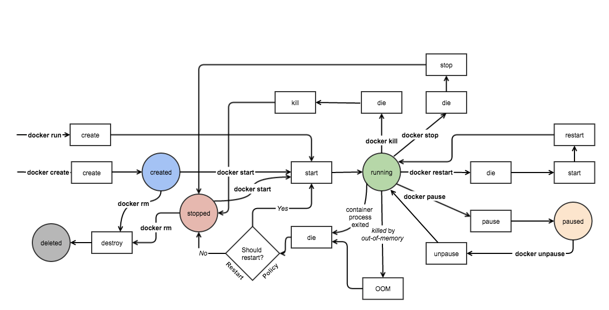

## Docker lifecycle



## Docker security

[docker_security.pdf](./docker.files/docker_security.pdf)

https://www.ssi.gouv.fr/uploads/2020/12/docker_fiche_technique.pdf

## Build 

Enable BuildKit
```sh
export DOCKER_BUILDKIT=1
```

Build a container when Dockerfile in folder
```sh
docker build -t <container_image> .```
```

## Image manipulation
Pulling an image from DockerHub
```
docker pull <my_awesome_image>
```
Removing an image
```
docker rmi <my_awesome_image>
```

## Remove 

Stop container
```
docker stop <my_container_name>
```
Remove container
```
docker rm <my_container_name>
```

### Remove image by base name

List image by base image
```
docker ps -a -q  --filter ancestor=<image-name>
```
### Chain container list and remove

```
docker rm $(docker stop $(docker ps -a -q --filter ancestor=<image-name> --format="{{.ID}}"))
```

## Run


### Container manipulation
List all running containers
```
docker ps
docker container ls
```
[Documentation](https://docs.docker.com/engine/reference/run/)
Run a container as daemon on port <host_port>
```
docker run -d \
    --name <my_container_name> \
    --rm \
    --publish <host_port>:<container_port> \
    <my_awesome_image>
```
-d : detached mode + --rm  : container is removed when main process exits or when daemon exists.
--name <my_container_name> allows to display a meaningful name when ```docker ps````
The alternative is the foreground mode (without -d)

Run a container in Docker with limited memory
```
docker run -d -name <my_container_name> \
    --publish 8080:8080 \
    --memory 200m \
    --memory-swap 1G \
    <my_awesome_image>
```
Run a container in Docker, limiting Memory & CPU
```
docker run -d -name <my_container_name> \
    --publish 8080:8080 \
    --memory 200m \
    --memory-swap 1G \
    --cpu-shares 1024 \
    <my_awesome_image>
```
