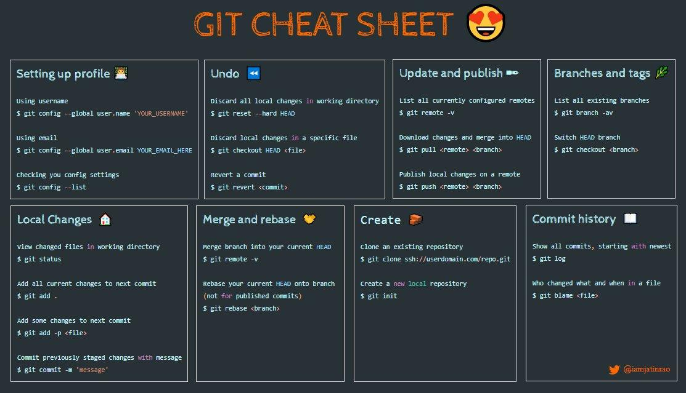

# Tips

When in detached HEAD
```sh
git checkout -
```

Change remote repo on github
```
git remote -v
git remote set-url origin <new.git.url/here>
git push -u origin <remote_branch>
```

### Under the hood


Git for software engineers - LIVE classroom


### Pocket Guide

#### Object store

Internally, every file managed by Git is stored as a blob:
- an  opaque chunk of data, a string of bytes
For every version of a file, the whole content is stored in a blob, giving priority to corruption protection before storage optimization.

Git does not save file permission, but 644 or 755 instead, to know if files are executable.

#### Commit

A commit is a snapshot, an the fundamental unit of change in Git. It consists of
- A pointer to a tree containing the complete state of repo at one point in time
- Meta information (author, comment, time)
- A list of zero or more commit objects that are called **parents**. (2+ parents means a merge occured, 0 parent means root commit).

You can introduce several root commits by
```sh
git checkout --orphan
```

The commit **author** is the person who changed the code and performed the commit.
The **committer** is the one who added the commit to the repo. Different from author in case of cherry-pick.

To display both
```sh
git log --format=fuller
````
