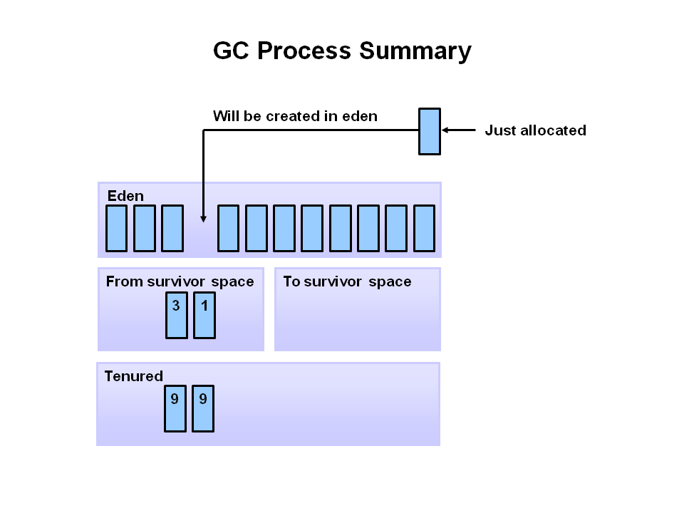

**How does the three generations interact/relate to each other?** Objects(except the large ones) are first allocated to the young generation. If an object remain alive after x no. of garbage collection cycles it gets promoted to the old/tenured gen. Hence we can say that the young gen contains the short lived objects while the old gen contains the objects having a long life. The permanent gen does not interact with the other two generations.

#### Memory

#### Heap

JVM uses this memory to store objects. This memory is in turn split into two different areas called the “Young Generation Space” and “Tenured Space“.

|Name|Description|
|---|---|
|Young Generation|The Young Generation is where all new objects are allocated and aged. When the young generation fills up, this causes a minor garbage collection. Minor collections can be optimized assuming a high object mortality rate. A young generation full of dead objects is collected very quickly. Some survived objects are aged and eventually move to the old generation.|
|Old Generation (Tenured)|The Old Generation is used to store long surviving objects. Typically, a threshold is set for young generation object and when that age is met, the object gets moved to the old generation. Eventually the old generation needs to be collected. This event is called a major garbage collection|

#### Young Generation
|Name|Description|
|---|---|
|Eden Space|When we create an object, the memory will be allocated from the Eden Space|
|Survivor Space|This contains the objects that have survived from the Young garbage collection or Minor garbage collection. We have two equally divided survivor spaces called S0 and S1|

#### Non Heap

JVM has memory other than the heap, referred to as non-heap memory. It is created at the JVM startup and stores per-class structures such as runtime constant pool, field and method data, and the code for methods and constructors, as well as interned Strings. Unfortunately, the only information JVM provides on non-heap memory is its overall size. No detailed information on non-heap memory content is available. The abnormal growth of non-heap memory size may indicate a potential problem, in this case you may check up the following: If there are class loading issues such as leaked loaders. In this case, the problem may be solved with the help of Class loaders view. If there are strings being massively interned. For detection of such problem, Object allocation recording may be used.|

|Name|Description|
|---|---|
|Permanent generation or MetaSpace|The **Permanent generation** contains metadata required by the JVM to describe the classes and methods used in the application. The permanent generation is populated by the JVM at runtime based on classes in use by the application. In addition, Java SE library classes and methods may be stored here. **Meta Space**: This memory is out of heap memory and part of the native memory. As per the document by default the meta space doesn’t have an upper limit. In earlier versions of Java we called this “Perm Gen Space". This space is used to store the class definitions loaded by class loaders. This is designed to grow in order to avoid 0ut of memory errors. However, if it grows more than the available physical memory, then the operating system will use virtual memory. This will have an adverse effect on application performance, as swapping the data from virtual memory to physical memory and vice versa is a costly operation. We have JVM options to limit the Meta Space used by the JVM. In that case, we may get out of memory errors.|
|Code Cache| JVM has an interpreter to interpret the byte code and convert it into hardware dependent machine code. As part of JVM optimization, the Just In Time (JIT) compiler has been introduced. The frequently accessed code blocks will be compiled to native code by the JIT and stored it in code cache. The JIT compiled code will not be interpreted.|

- Tenured gen
- Eden space
- survivor space
- Non Heap
- metaspace
- code cache