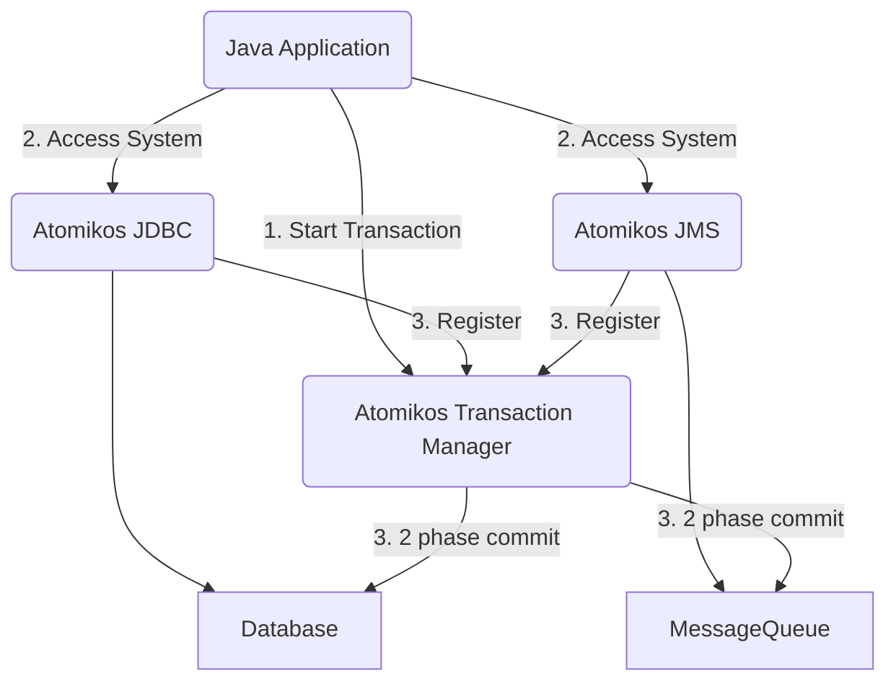

# Atomikos

- [Source article](https://www.baeldung.com/java-atomikos)

- [Atomikos](https://www.atomikos.com/Main/WebHome) is a transaction library for Java applications

## Definition

### Transactions

> a Transaction is a logical unit of work whose effect is visible outside the transaction either in entirety or not at all

- Example in retail application
  - Reserve the inventory 
  - Place the order

- A transaction can involve multiple independent operations
  - local transaction
    - transaction within a single resource
  - distributed transaction
    - transaction spawning across multiple resources

### XA Specification

- XA refers to
  - Extended architecture
  - A specification for distributed transaction processing
  - Goal
    - provide atomicity in global transactions involving heterogeneous components

- XA provides integrity
  - Through a protocol known as two-phase commit
    - eases the decision to commit or rollback a distributed transaction

### JTA

- [Java Transaction API](https://www.oracle.com/java/technologies/jta.html)
  - is a Java Enterprise Edition API developed under the Java Community Process
  - enables Java applications and application servers to perform distributed transactions across XA resources.
- JTA is modeled around XA architecture, leveraging two-phase commit. 
- JTA specifies standard Java interfaces between a transaction manager and the other parties in a distributed transaction.

## Atomikos

- JTA is a specification
  - ==Transaction Manager== is the implementation

- Some application servers provide support for transaction (EJB containers)
  - But sometimes we need direct control over the transaction independent of the application server

- Atomikos is a lightweight transaction manager for Java
  - our application doesn’t need to rely on a heavyweight component like an application server for transactions

### Atomikos architecture



### Product

- Open Source
  - TransactionsEssentials
  - Atomikos’ open-source product providing JTA/XA transaction manager for Java applications working with databases and message queues.
- ExtremeTransactions
  - commercial offering of Atomikos, which offers distributed transactions across composite applications
    -  including REST services apart from databases and message queues.

### Setting up

- Embedded transaction service


#### Dependencies

- Maven

```xml
<dependency>
    <groupId>com.atomikos</groupId>
    <artifactId>transactions-jdbc</artifactId>
    <version>6.0.0</version>
</dependency>
<dependency>
    <groupId>com.atomikos</groupId>
    <artifactId>transactions-jms</artifactId>
    <version>6.0.0</version>
</dependency>
```

#### Configurations

- Provide a ```transactions.properties``` file in the classpath
  - contains several parameters for the initialization and operation of the transaction service
  - e.g : override the directory where log files are created:
    - control the timeout for transactions
    - set unique names for our application
    - define shutdown behavior.

#### Databases

- In tutorial, a simple retail application is exposed, which
  - reserves an inventory
  - places an order
  - based on relational databases
  
### Working with Atomikos

- Using built-in resource adapters to connect with our backend database systems

#### UserTransaction

- Implement JTA UserTransaction to demarcate transaction boundaries
```java
UserTransactionImp utx = new UserTransactionImp();
```

#### DataSource

- AtomikosDataSourceBean
  - is aware of an underlying XADataSource:
```java
AtomikosDataSourceBean dataSource = new AtomikosDataSourceBean();
```
- AtomikosNonXADataSourceBean
  - uses any regular JDBC driver class
  - In case targeted db does not support XA specification
  - Still tries to provide atomicity if there is a single such data source in the transaction. 
    - This technique is similar to Last Resource Gambit,
```java
AtomikosNonXADataSourceBean dataSource = new AtomikosNonXADataSourceBean();
```

#### Performing Db operations

- See ```com.baeldung.atomikos.direct.Application```
  - ```public void placeOrder(String productId, int amount) throws Exception```

#### Testing Transactional Behavior

