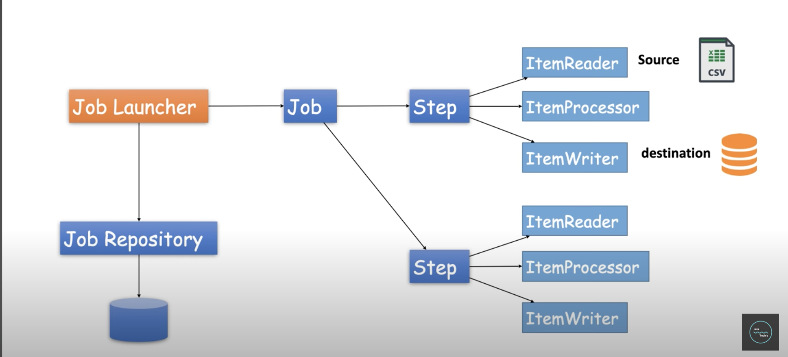
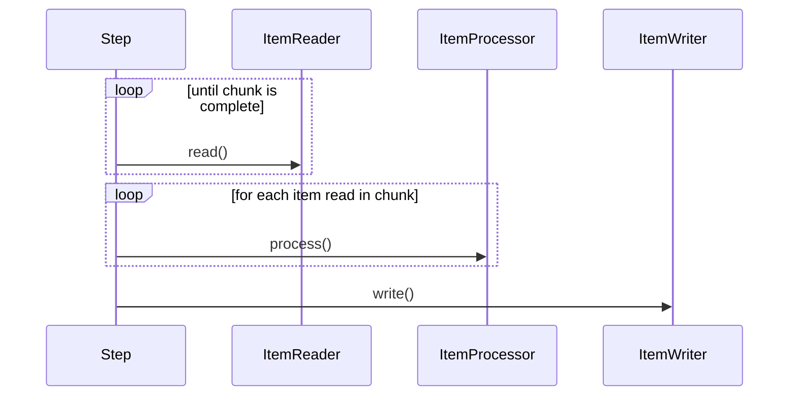
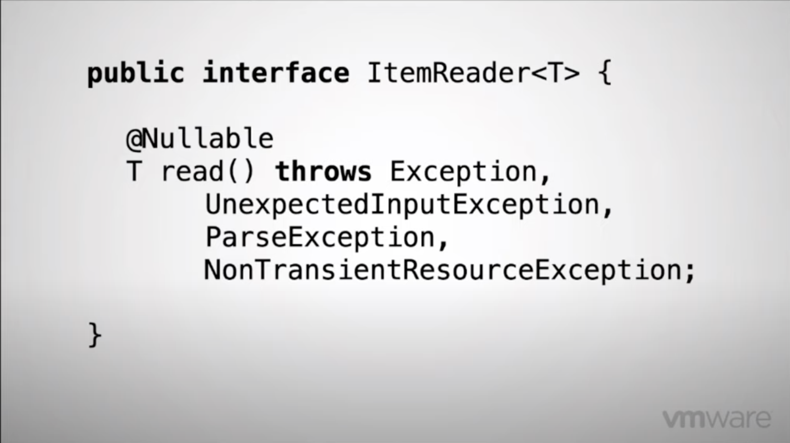
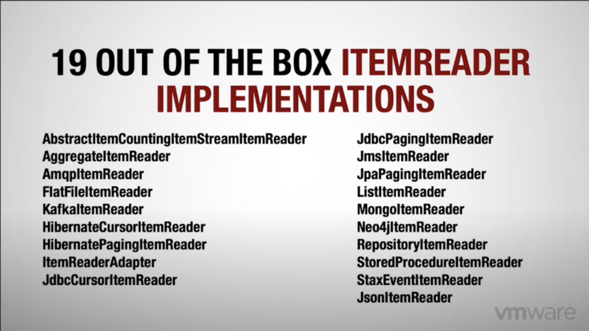
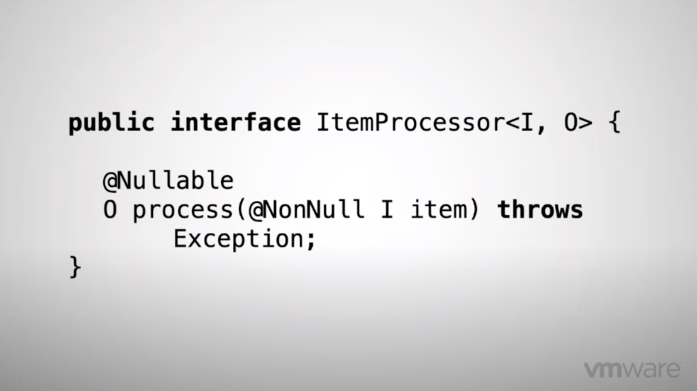
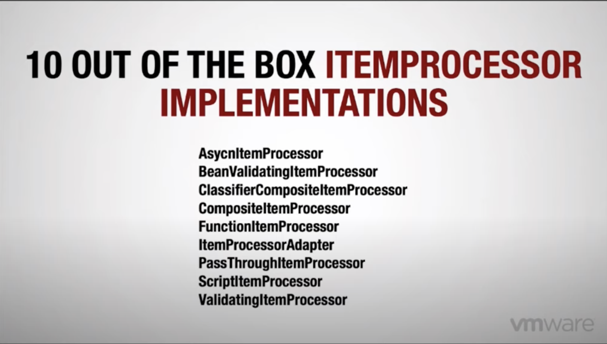
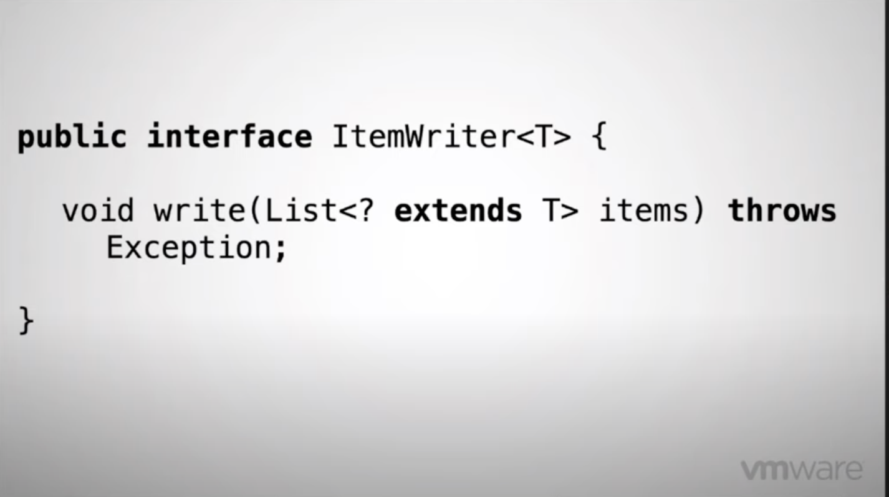
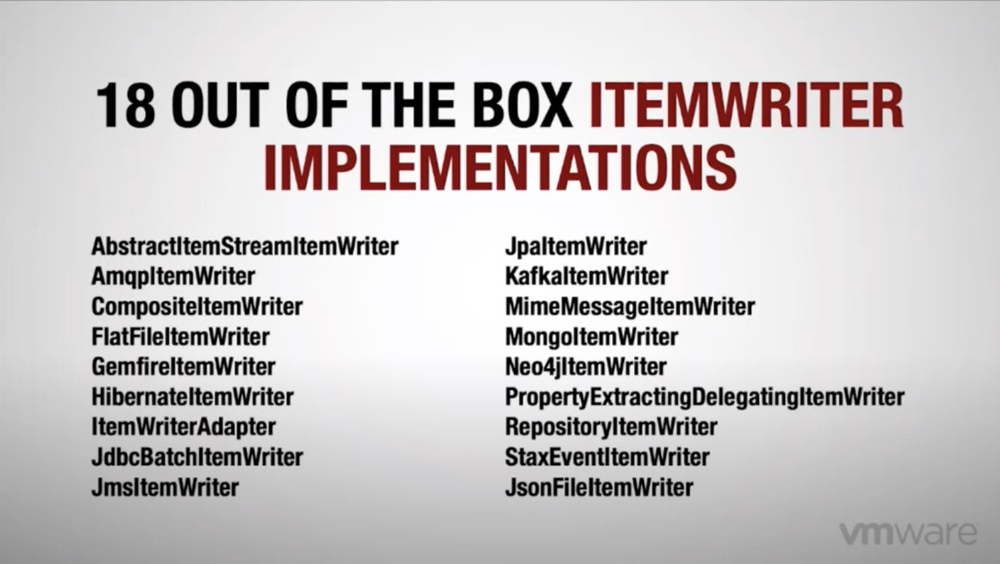
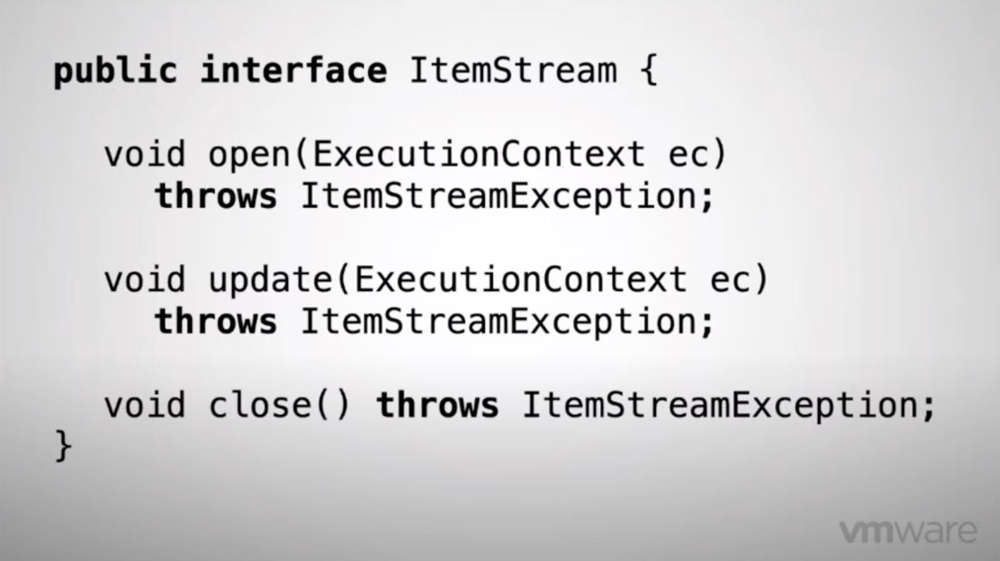

# Spring batch architecture

- 

- [Youtube Source](https://www.youtube.com/watch?v=hr2XTbKSdAQ&t=937s)

## Definitions 

- Batch processing
  > Processing a finite amount of data without interaction or interruption
  - does not wait for any external stimulus

- ==Job==
  - Finite process from end to end
  - Can be scheduled
  - Can be divided into one or more ==steps==

- ==Step==
  - Can be executed in sequence or in parallel
  - Directed graph
  - Self contained unit of work
  - Two types of ==Step==
    - ==Tasklet==
      - Interface in Spring Batch
      - execute() method will be executed in the scope of a transaction
      - can be a lambda
      - returns a Repeat status
        - RepeatStatus.FINISHED (end of the processing)
        - RepeatStatus.CONTINUABLE (run again the tasklet)
    - ==Chunk==
      - ==Items== in a loop
      - Looping over a large collection of data
      - ==Item==
        - Individual record in db
        - Line in a file
      - a chunk is a group of items processed in a single transaction

## Flow of Steps / Components 

- Step1
  - ItemReader / ItemProcessor / ItemWriter
- Step2
  - ""
- Step3
  - ""



- ItemReader and ItemProcessor cannot run in parallel
  - ItemProcessor and ItemWrite can be run in //

### ItemReader

- 

- Returns one item to be processed

#### ItemReader implementations

- 

### ItemProcessor

- 

- Should be idempotent
  - If errors occur, processor will be run more than once

#### ItemProcessor implementations

- 

- Falls into 2 buckets
  - Validation
  - Adapting of some kind

### ItemWriter

- 

#### ItemWriter Implementations

- 

### ItemStream

- 

- Provides a lifecyle to each one of the stateful components
- When a Step starts
  - the ```open(ExecutionContext ec)``` is called
  - allows the component to reset the state of execution
- After each Chunk is completed
  - the ```update(ExecutionContext ec)``` is called
- The ```close()``` method allows to clean any resource that is not needed

### ExecutionContext

- ```ExecutionContext``` is essentially a ```Map``` that persists the state
- A lots of adapter/utility methods exists on it

### Step scope

- ```@StepScope``` means to lazily initialize component until it is within the step it is running.


## Architecture

- JobLauncher
- JobRepository
  - jobs are stateful
  - Spring batch keeps track of what job is run, with what parameter...
  - allows to handle skip, retries...
  - is a relational data store
- Job reports to JobRepository "I am executing step X step Y"

- Monitoring
  - Prometheus
    - Is a poll model
    - Calls the app to get metric
    - But batch app might be off when called  
  - Rsocket proxy allows spring batch to report metrics to it in a push model
    - Prometheus will scrape the proxy instead of the app
  - Grafana
  - 
## Spring Config objects

### Csv reader

- ```FlatFileItemReader<T>```
  - with methods setResource, setName, setLinesToSkip, setLineMapper
  - is not thread-safe, won't work with partitioner
- ```LineMapper<T>```
  - tokenizer
  - setFieldSetMapper()
- ```BeanWrapperFieldMapper<T>```
  - setTargetType T

### Processor

- implements ```ItemProcessor<T,U>```
  - ```U process(T)```

### DB writer

- ```RepositoryItemWriter<U>```
  - setRepository (e.g JpaRepository)

