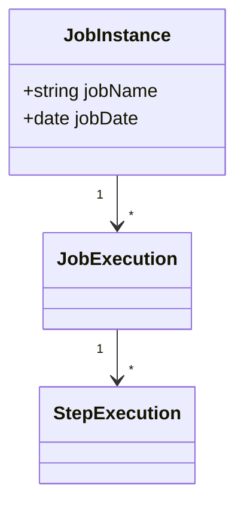

# Batching for the Modern Enterprise


## Concepts



- A JobExecution is the physical run of the JobInstance (Job name + date)
  - Restarts of job lead to several JobExecution 

- Each JobExecution may have several StepExecutions based on how many Steps are configured for the Job

### RunIdIncrementer

In Job Bean definition, the ```.incrementer(new RunIdIncrementer())``` allows to avoid the need to change input parameter.


