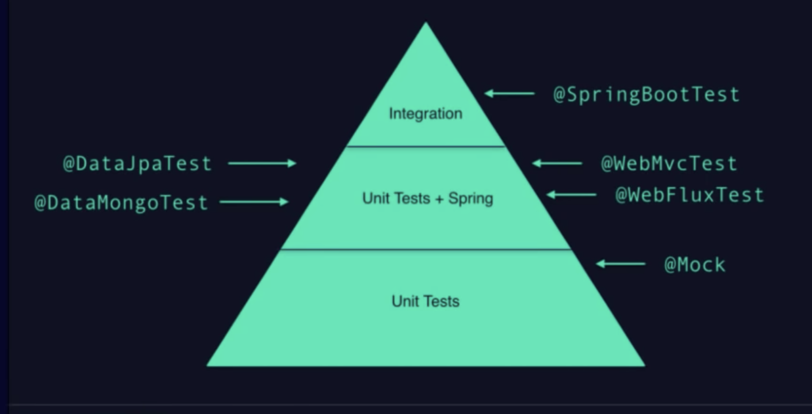

#### Obstacles to TDD

- What should we test ? 
    - tests Cache behaviour, cache implementation

- Do we need integration tests, at which level ?

- How do we do Pair programming ?
    - ping / ping pairing : one starts with the test, the other writes the minimal code to pass the test

1.4 adds new Annotations for test
AssertJ annotations 




#### Workflow

2 approaches for TDD
- **Top-Down approach**
    - Used here
    - Write a global failing test (integration test)
    - Describe all features
    - Global test turns green when all the features are implemented
    - Pipeline is red most of the time
- Bottom-up approach
    - You start with a simple unit test
    - Integration testing comes at the end



graph LR;
    integration_test(1. Integration Test<br/>SpringBootTest<br/>webEnvironment is RANDOM_PORT<br/>TestRestTemplate) --> create_entity(2. Create Entity<br/>Define fields<br/>getters setters)
    create_entity --> test_controller(3. Controller test<br/>WebMvcTest<br/>MockMvc)
    test_controller --> build_controller(4. Create HTTP Controller<br/>RestController<br/>GetMapping)



1. First integration test -> 404 because no endpoint, no controller.
- @RunWith(SpringRunner.class) and @SpringBootTest(webEnvironment=RANDOM_PORT) on top of class
- Essence of this test = describes basic concerns:
    - url
    - return a car
- uses a TestRestTemplate as dependance to perform the query, @Autowired
    - restTemplate.getForEntity("/cars/prius", Car.class)
- Check response status code, body with AssertJ library, which comes for free with "spring-boot-start-test" dependency in pom

2. Create Car Pojo
- define instance parameter and types

3. Create a Test for the Controller CarControllerTest
- @RunWith(SpringRunner.class) and @WebMvcTest(CarControllerTest.class) on top of class
- WebMvcTest is a test slice
- MockMvc, MockMvcRequestBuilders.get("/endpoint").andExpect()....
    - checks status
    - jsonPath for body
- inject CarService with @MockBean annotation, parameter its resonse with given(...).willReturn(...)
- Test corner cases with exceptions (e.g: CarNotFoundException thrown by service layer) with another mockMvc call

4. Create a HTTP Controller
- ResController
- GetMapping with 
- Add the dependency with carService (carServerice.getCarDetails())
- Add an exception handler @ExceptionHandler / @ResponseStatus()


graph LR;
    service_test(5. CarService Test<br/>MockitoJunitRunner) --> build_service(6. Implement CarService<br/>call repository<br/>throw exception)
    build_service --> test_repo(7. Test CarRepository<br/>DataJpaTest)
    test_repo --> build_repo(8. Build CarRepository<br/>as an interface</br>extends CrudRepository)


5. Test for Service
- Lightweight unit test without Spring interaction
- Adds a @Mock CarRepository, parametered with given(...).willReturn(...)
- Test when car is found and when car is not found

6. Implement carService
- Implement both cases:
    - car found
    - car not found

7. Test CarRepository
- @RunWith(SpringRunner.class)
- @DataJpaTest, allows to autowire repository
- Adds a @Autowired CarRepository
- test method just launches 
```java
Car car = repository.findByName("prius")
``` 
and performs assertions on result.
- On CrudRepository, if you do save() and findByName(), entity will be taken from 1st level cache and not DB 
- To solve this, use ```TestEntityManager``` to fetch from DB: ```entityManager.persistFlushFind(...)```

8. Implement CarRepository
- Interface extending CrudRepository<Car,Long> to get benefit from predefined methods
- Car findByName(String name); can be auto-generated by Spring


graph LR;
    caching_test(9. Caching Test<br/>SpringBootTest<br/>AutoConfigureTestDatabase) --> build_caching(10. Implement Cache<br/>Cacheable annotation)


9. Caching Test
- No unit level test for caching, because it uses @EnableCaching is applied on Root Application Class, it is only loaded when the whole application is launched.
- @AutoConfigureTestDatabase to load an embedded database for tests (H2)
- We need to use a @SpringBootTest with web environment= None
- @MockBean CarRepository
- The Test consists in calling carService.getCarDetails(...) **twice** and check the repo was called only **once** with ```verify()``` mockito method

10. Cache implementation
- ```@Cacheable("cars")``` on public Car getCarDetails(String name) method of CarService.


Implement a spring controller (CarController)
@WebMvcTest => not all the application context is loaded

This kind of test is faster than Spring Boot.

```java
@RunWith(SpringRunner.class)
@WebMvcTest(CarController.class) // Does not load whole spring boot. You can specify which controller you need to fire up
public class CarControllerTest {
    @Autowired
    MockMvc mockMvc;

    @Test
    public void shouldReturnCar() throws Exception {
        mockMvc.perform(MockMvcRequestBuilders.get("/cars/prius"))
                .andExpect(status().isOk())
                .andExpect(jsonPath("name").value("prius"))
                .andExpect(jsonPath("type").value("hybrid"));
    }
}
```

We still have a 404 because the spring controller is empty. Let's add ```@RestController``` annotation on CarController and declare one endpoint.
Adds an endpoint, which returns null, jsonPath will make test fail.

Use ```given()``` method from Mockito, to mock carService. ```@MockBean``` annotation when carService is declared.

CarController implementation is done. CarService not. It is mocked in test.

Next, test when the car is not found, Mock CarService so that it throws CarNotFoundException.
The mockMvc test will expect to have a notFound() status.

Tests fails because there is no exception handler. Add one in the controller.

Other way to do it is (without ExceptionHandler), as the exception is thown in the web component, to add ```@ResponseStatus``` on CarNotFoundException.

At this point, the controller is ok. 
```java
package com.theatomicity.tdd;

import org.springframework.beans.factory.annotation.Autowired;
import org.springframework.http.HttpStatus;
import org.springframework.web.bind.annotation.*;

@RestController
public class CarController {
    @Autowired
    CarService carService;

    @GetMapping("/cars/{name}")
    private Car getCat(@PathVariable String name){
        return carService.getCarDetails(name);
    }

    @ExceptionHandler
    @ResponseStatus(HttpStatus.NOT_FOUND)
    private void carNotFound(CarNotFoundException e){}
}
```

But the integration test will fail, because the service is empty

```java
package com.theatomicity.tdd;

public class CarService {

    public Car getCarDetails(String anyString) {
        return null;
    }
}

```

We need to write a test for the CarService, that will be a simple Mockito test using the junit runner ```@RunWith(MockitoJUnitRunner.class)``` instead of the Spring runner.

- shouldReturnCarInfo && shouldThrowCarNotFoundException test allows to define getCarDetails() implementation by mocking repository and testing 2 types of responses (ok and nok).

Let's go on with CarRepositoryTest

We use ```@DataJpaTest``` annotation that loads only the Jpa components from Spring. Here we use ```@Autowire``` to get a running CarRepository.

Test will fail because we have not spring-data-jpa in pom dependencies.

We want to use ```CrudRepository``` interface to get findByName method for free.
for this we use 
```xml
<dependency>
    <groupId>org.springframework.boot</groupId>
    <artifactId>spring-boot-starter-data-jpa</artifactId>
</dependency>
```
instead of spring-data-jpa.