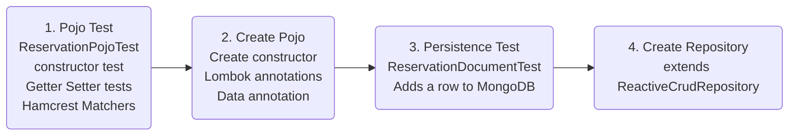
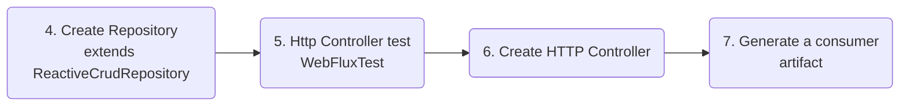
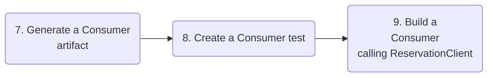
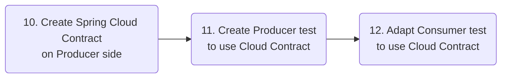

Test support is provided out of the Box, with an annotated @SpringBootTest class.

- 2 ways to perform TDD:
  - Inside-out: From low level components to high level ones. Suitable for simple project.
  - Outside-in: Test API first to prevent integration risks between 2 teams.

Red-Green refactoring: Someone writes the failing test, the other writes the code that makes the test pass. Ping pong refatoring.

- Test Pyramid:
  - Top : Slow test, integration tests and E2E tests
  - Bottom : Fast Feedback test

#### Producer



- ReservationPojoTest:
  - Goal: Test the creation of a Domain object
  - Make custom Matcher by extending base matcher.

- ReservationDocumentTest:
  - Goal: test if we can add a reservation to a running local mongo instance
  - Add a persist() mathod
  - Add a private ReservationRepository instance field to test class, with @AutoWired
  - Create ReservationRepository interface extending ReactiveCrudRepositoryn
  - Create a reservation with id = null in test method
  - Add @RunWith(SpringRunner.class)  on top of class to make Spring work with Junit
  - Add a @DataMongoTest on top of class to bring
      - Mongo support
      - Cache support
      - Disables all auto-configuration except from these
  - Use a Stepverifier to validate test result
      - StepVerifier.create(..).expectNextMatchers(t -> t...).verifyComplete()




- ReservationHttpTest 
  - Add @WebFluxTest on class, which is a Test slice that only triggers 
      - webflux components
      - reactive non blocking http client
      - Json
      - Cache
      - Disable all other auto-configuration
  - Add a WebTestClient as private instance field, with @AutoWired annotation.
  - Add a get() method wich uses webTestClient
      - this.webTestClient.get().uri("localhost:8080/reservations).exchange()....
          - expectHeader / expectStatus / 
          - expectBody with jsonPath

- Create http controller that provides http endpoints
  - Create a configuration class ReservationHttpConfiguration annotated with @Configuration
  - Add a method annotated with @Bean that provides a RouterFunction (reactive endpoint)
  - Short method
      - Declare routes
      - Inject repository and return entities as serverresonse in route().GET()
  - Long method
      - Map routes to mathods in Handlers ( ~ Service layer)
  - Modify WebTestClient
      - Inject ReservationHttpConfiguration.class in WebFluxTest test slice
          - @Import(ReservationHttpConfiguration.class) on top of test class
      - Create @MockBean for repository
          - Replaces or adds a mocked Bean in the application context of Mockito.mock type
          - Make a stub to make it response in a pre-programmed way
              - Mockito.When(....).thenRetun(....) with a Flux.just() as a result

#### Consumer

- Generate a consumer artifact
  - Goal : Distribute a client that can talk to your service.
  - Create a new artifact on start.spring.io
      - Lombok
      - Spring Reactive Web
      - Stub Runner




- Write a ConsumerApplicationTestt
  - Annotated with @SpringBootTest and @RunWith(SpringRunner.class)
  - With ReservationClient private instance field (@Autowired)
  - call reservationClient.getAllReservations() that returns a Flux(Reservation)
  - Use StepVerifier to check return
      - StepVerifier.create(..).expectNextMatches(...lambdas...)

- Create a ReservationClient
  - Create DTO Reservation
      - With Lombok annotation : @Data, @AllArgsConstructor, @NoArgsConstructor
  - Adds @Component on top of class
  - Add a WebClient as dependency (reactive web client), as private final field.
      - injected in the constructor with Lombok annotation @RequiredArgsConstructor
  - Implement getAllReservations() method:
      - return this.client.get().uri("http://localhost:8080/reservations").retrieve().bodyToFlux(Reservation.class);
  - Add a WebClient with @Bean annotation. 

At this point the consumer test fails, because we don't have anything to test the client.

We need to mock out this service using WireMock
```java
var json = '[{some:"entity"}]';
WireMock.stubFor(WireMock.get(WireMock.urlEqualTo("/reservations"))
.willReturn(WireMock
    .aResponse()
    .withBody(json)
    .withHeader(...)
    .withStatus(HttpStatus.OK.value()));
```
WireMock is like a Stub but for network service.
Add @AutoConfigureWireMock(port=8080) to make wireMock work.

If Pojos on producer and consumer sides might be not aligned (fields differ). 
Integration test should be performed to verify it.

WireMock is ideal for very stable API.

You need a way to validate the API has changed. In a Monolith, the compiler will detect if fields are missing, but there is no compiler for network APIs.

#### Spring Cloud Contract

Gives a way to detect that an API has made breaking changes.

##### Producer side

Declared here in the producer, but it can be also on the consumer side or in a share place.
It is supposed to define an interaction that is supposed to work.





- You declare a DSL that is transpiled to a test, which runs against your API.

```groovy
Contract.make {

    description("/reservations")
    request {

        url("/reservations")
        method(HttpMethods.HttpMethod.GET)
    }
    response {
        status(200)
        body ([
                [id: 1, name: "Ayman"],
                [id: 2, name: "Chinmay"]
        ])

        headers { contentType(MediaType.APPLICATION_JSON_VALUE)}

    }
}
```

You then need to configure the Spring Cloud Contract plugin in pom, by configuring a BaseClass in pom.xml

- Write a @SpringBootTest BaseClass
  - add a mock repository with @MockBean
  - Declared the port on which the WebapplicationContext will be launched.

The transpiled version of the Cloud Contract will generated in standard Junit TEST ContractVerifierTest.java

##### Consumer side

- Instead of using WireMock, we are going to use that contract to validate what I have done.

In ConsumerApplicationTests.class:
- Add @AutoConfigureStubRunnner(ids="<maven_coodinates>", stubsMode=StubRunnerProperties<Mode=Local,Artifactory..>) to launch a Stub Http Service.
- See how test fails because POJO didn't have the same properties in producer and consumer side.

You can even launch the stub runner from a jar file, it will output the response defined in your contract.