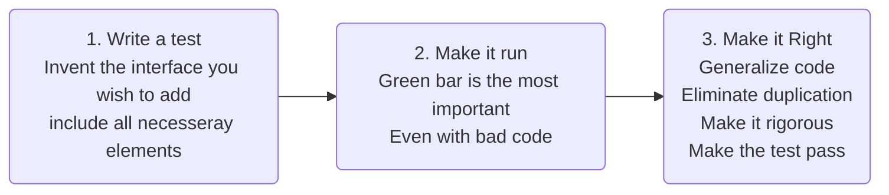
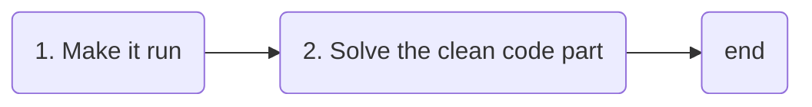
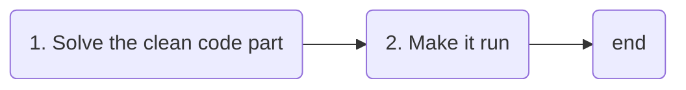
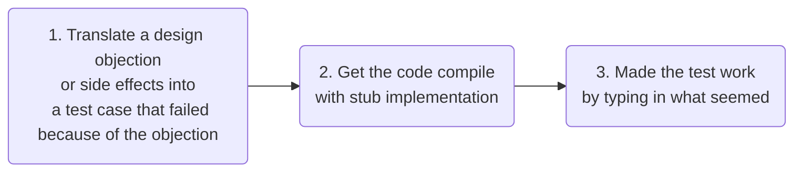

- Make a todo list of what needs to be done
- Decide which test needs to be done first
    - start small or not at all
    - Imagine the most simple, expressive interface for the object
    - write and run test event if target class does not exist, test will fail
    - make the test compile with stubs
    - make the test run by committing horrible sins (wrong field visibility...)
    - Gradually genealized the working code, replacing constants with variables

- TDD Short workflow

Test Driven development = Clean code approach

Is the opposite of Architecture Driven development

The handling of side effects is important: Translate feelings (disgust at side effect) into a test

When choosing a design pattern (ex: Value Object): 
- identify the critical operation to be implemented (ex: equality)
- implement obvious things
- test it further
- refactor when all test cases are set

> When refactoring, fix the visibility of fields/methods/class.

> Expand code by shamelessly duplicate existing class and existing test but commit to remove **duplication** afterwards

> Tackle duplication: Move common code to superclass, Make the second subclass, make sure tests for both subclasses work

Chap9